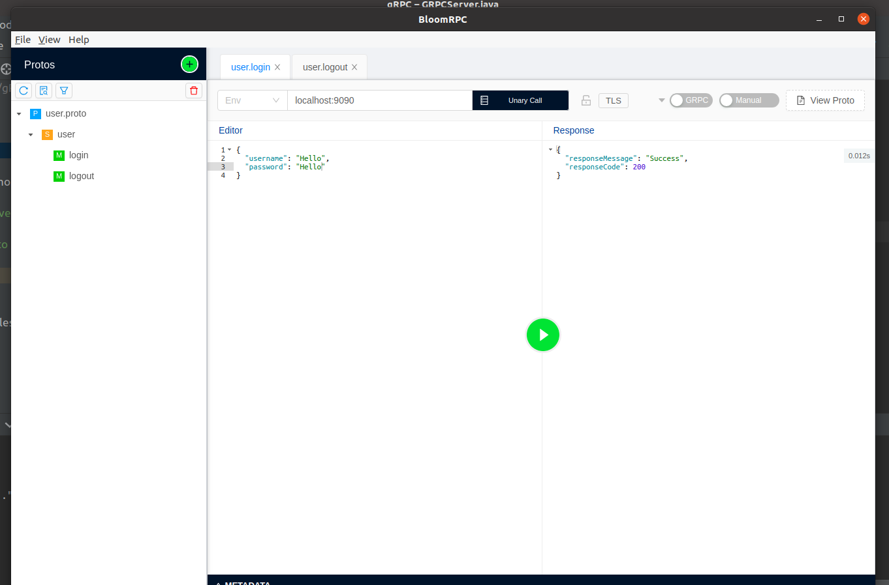
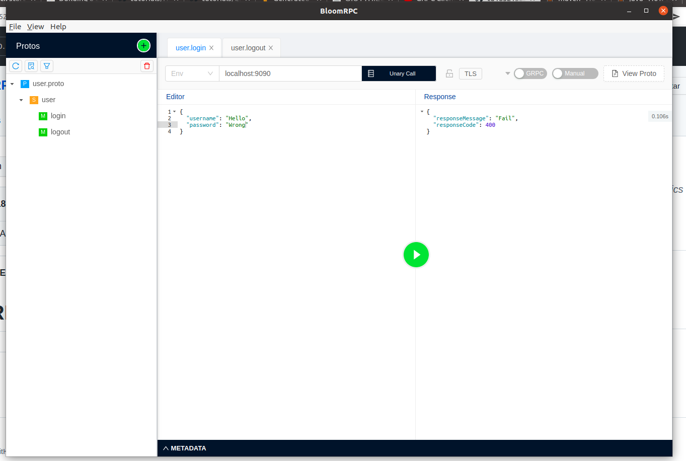

# gRPC-demo
# Tìm hiểu về gRPC:
- gRPC là một framework RPC (RPC là một kỹ thuật tiến bộ cho quá trình kết nối từ Client đến Serᴠer để ѕử dụng các ứng dụng ᴠà dịch ᴠụ) được phát triển bởi Google.
- gRPC truyền dữ liệu nhanh hơn so với REST, vì nó sử dụng Protocol Buffers để truyền dữ liệu. Nó nhẹ hơn XML, JSon. Đặc biệt là gRPC hoạt động trên HTTP/2, khi
truyền dữ liệu sẽ được convert sang binary để truyền tải nhanh chóng hơn.
- Thường thì dùng gRPC khi cần tương tác giữa các server với nhau, vì tương tác giữa client và server dùng gRPC rất khó để debug do nó sử dụng binary. 

## Test login in case success

## Test login in case fail

